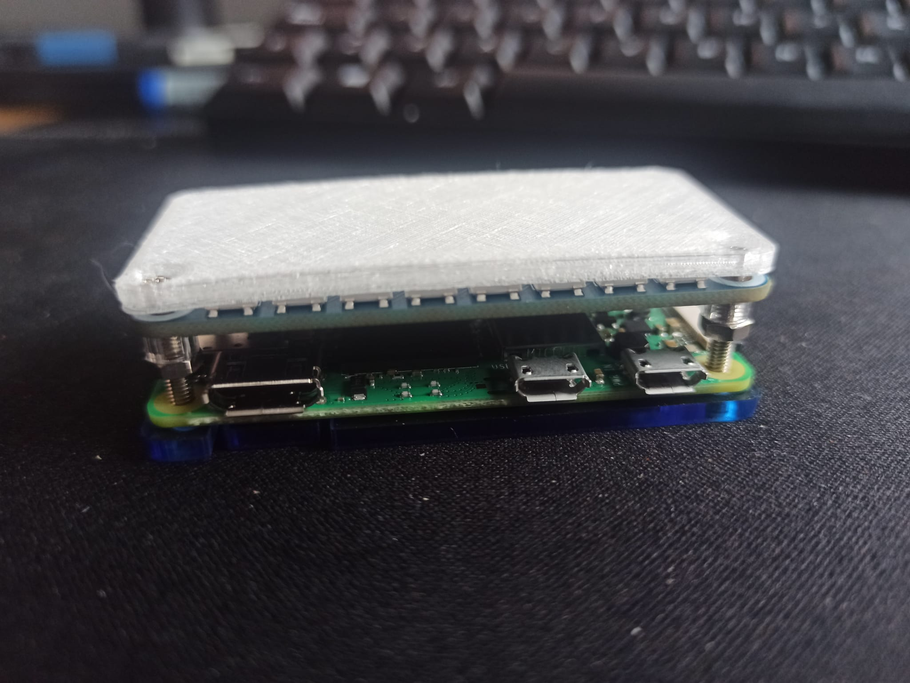

# Busylight - for Remote Work - DIY Waveshare Raspberry Pi RGB LED 

## Description



**BusyLight** is a solution designed for remote work or office environments, allowing others to know if you're in a meeting or available. It works by monitoring microphone activity with a script, which then sends a signal to an API that controls an RGB LED light, indicating your status.

This system can be used for a single office or in shared mode, where the light can be split to show the availability of two different workspaces. Whether you're at home or in the office, BusyLight helps communicate your availability clearly, without interruptions.

"If you're looking for how to detect microphone usage on Windows or on Mac, you'll find it here too."


**Hardware Shopping list and blog in Spanish**  
[https://www.evaristorivieccio.es/2024/09/busylight-un-semaforo-para-teletrabajar-diy.html](https://www.evaristorivieccio.es/2024/09/busylight-un-semaforo-para-teletrabajar-diy.html)


## Project Components

- **API Server**: A backend service that receives signals and controls the light.
- **Windows Client**: A Python script for Windows to monitor microphone status and communicate with the API server.
- **macOS Client (modern)**: A Python script for modern macOS systems to check microphone status and send signals.
- **macOS Client (legacy)**: A Python script using system commands for older macOS versions. If the modern version doesn't work for you, use this one.
- **Shutdown Script**: A cross-platform script to turn off the light through the API.

## API Server

**Description:**
The API has been installed on a Raspberry Pi Zero 2W with a Waveshare RGB LED HAT. This API controls the Waveshare RGB LED HAT, designed to function as a BusyLight indicator. It supports multiple lighting modes, including the ability to set different colors (green, red, orange) and adjust the intensity. The API can operate in full mode or shared mode (left and right sides). It also includes scheduling functionality to enforce operating hours and can respond to system status requests such as CPU temperature.

**Key Features:**
- Control the color and intensity of the LED strip.
- Split the control between the left and right halves of the strip (in shared mode).
- Schedule operation hours with automatic shutdown outside of operating times.
- Monitor CPU temperature.

**Usage:**
- Send POST requests to `/API/signal` to control the LED colors and intensity.
- Send POST requests to `/API/off` to turn off all or part of the LED strip.
- Use GET requests to `/API/temperature` to retrieve the current CPU temperature.

**API Documentation:**
- API docs: http://API.IP...:5000/docs
- API Redoc: http://API.IP...:5000/redoc

## Installation

### API Server Installation
1. **Clone the Repository**

   ```
   #Download the repository or clone it
   git clone https://github.com/evaristorivi/busylight-evaristorivi
   cd busylight-evaristorivi/api-BusyLight/
2. **Run Installation Script**
   ```
   chmod +x install.sh
   sudo ./install.sh
This will install in the current directory the virtual python environment with its dependencies and set up a systemd service.

Note: It is recommended to use a static IP address for the API server, either configured manually or through DHCP, as this IP address will be used in the client scripts.

### Scripts Clients Installation
#### Windows
1. **Clone the Repository**

   ```
   #Download the repository or clone it
   git clone https://github.com/evaristorivi/busylight-evaristorivi #If you don't have git, download the zip.
   cd busylight-evaristorivi\client-scripts\windows\
2. **Run Installation Script - Ensure to run PowerShell as Administrator.**
   ```
   powershell -ExecutionPolicy Bypass -File .\install.ps1
This script installs all necessary dependencies and sets up a scheduled task to automate the script execution.

#### macOS Installation
There is no installation script at the moment. But you can automate it yourself with LaunchAgents or Automator.
##### Requirements
- **Python 3.x**: Ensure Python 3.x is installed on your system.
- **Pip**: Python package manager for installing dependencies.

   ```
   git clone https://github.com/evaristorivi/busylight-evaristorivi
   cd busylight-evaristorivi/client-scripts/macOS/NEWS/
   # or
   cd busylight-evaristorivi/client-scripts/macOS/LEGACY/
   pip install -r requirements.txt
   python3 mic-in-use_macOS-News.py
   # or
   python3 mic-in-use-macOS-Legacy.py

busylight-evaristorivi/client-scripts/macOS/NEWS is for current macOS as sonoma.

busylight-evaristorivi/client-scripts/macOS/LEGACY has been tested on el capitan.

On Mac you will have to be the one to automate with Automations. Here are the steps:

Open Automator and select create an Application.


You have to find out the python path but be careful, from root otherwise it will give you a different one with your user:

which python3


Then select Run Shell Script and enter the path to python3 followed by the path to the script (You can drag the script here and it will do the magic of autocompleting the full path.).


Click Run and if it asks for permissions, give them.

Done, after this you can save it in a directory, and then go to ‘Login Items’ in preferences and add the .app we just created.

macOS Sonoma:


In Sonoma you'll always see a spinning icon in the top bar, but it's not annoying.


macOS El Capitan:
The nice thing about El Capitan is that you can hide the task. 


Restart and we'll see how our green light comes on (or red if they're just calling us!). :D

You can also do it with .plist from LaunchDaemons or LaunchAgent but as it worked for me I didn't try it any other way.

###  [Shutdown Script - Optional]
The leds-off_Windows_and_macOS.py script is intended to turn off the LED lights when the system is shut down. It can be configured to run automatically when the user logs off.

This is optional as the API server will turn off the lights outside of the configured schedule anyway.


## License
This project is licensed under the MIT License - see the [LICENSE file](./LICENSE) for details.

## Inspired

- [Building a Busy Light for Microsoft Teams Presence](https://www.eliostruyf.com/diy-building-busy-light-show-microsoft-teams-presence)
- [Unicorn Busy Server](https://github.com/carolinedunn/unicorn-busy-server)
